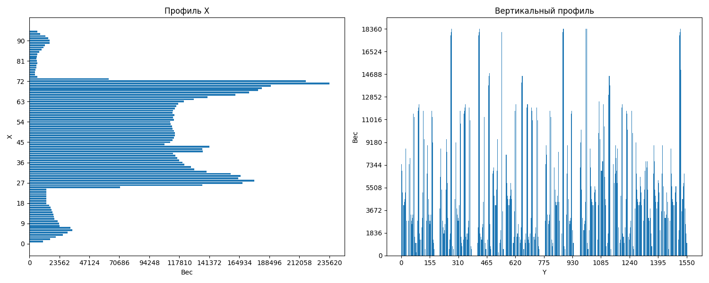
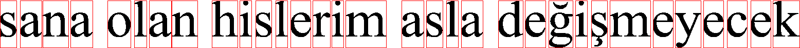
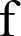
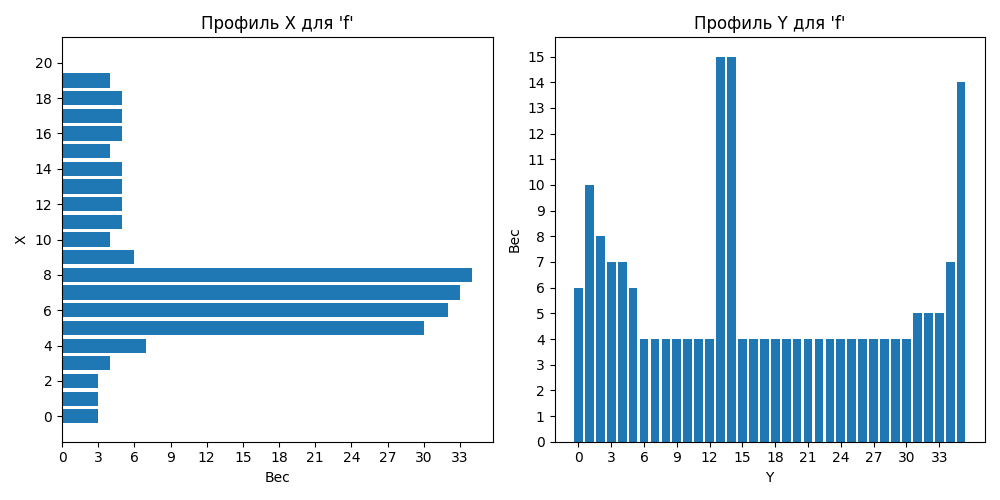

# OAVI_lab6
_Сегментация текста_

### Вариант 18

**Турецкие строчные буквы**

Была поставлена следующая задача:

1. Подготовить в Microsoft Word романтическую фразу с выбранным алфавитом
2. Сделать скриншот и сохранить в монохромный BMP-файл без белого фона
3. Реализовать алгоритм расчёта горизонтального и вертикального профиля изображения
4. Реализовать алгоритм сегментации символов в строке на основе профилей
5. Построить профили символов выбранного алфавита

***

## Функции

Основные функции находятся в файле `segmentation.py`.

### segmentation.py

- `binImg(filename: str, resultFilename: str) -> None`
    > Преобразует изображение в монохромное с обрезкой лишних полей
    >
    > _ПАРАМЕТРЫ:_  
    >    * **filename** - Путь к исходному изображению  
    >    * **resultFilename** - Путь для сохранения результата  

- `profiles(filename: str, profileFilename: str) -> tuple`
    > Вычисляет и визуализирует горизонтальный и вертикальный профили
    >
    > _ПАРАМЕТРЫ:_  
    >    * **filename** - Путь к изображению  
    >    * **profileFilename** - Путь для сохранения графиков  
    >
    > _ВОЗВРАЩАЕТ:_  
    >    * Кортеж (горизонтальный профиль, вертикальный профиль)

- `segmentation(filename: str, hProfile: list, vProfile: list) -> list`
    > Сегментирует текст на изображении на отдельные символы
    >
    > _ПАРАМЕТРЫ:_  
    >    * **filename** - Путь к изображению  
    >    * **hProfile** - Горизонтальный профиль  
    >    * **vProfile** - Вертикальный профиль  
    >
    > _ВОЗВРАЩАЕТ:_  
    >    * Список координат прямоугольников символов (x1, y1, x2, y2)

- `imgChar(char: str, fontPath: str, fontSize: int, folder: str) -> None`
    > Создает изображение символа с заданным шрифтом
    >
    > _ПАРАМЕТРЫ:_  
    >    * **char** - Символ для отрисовки  
    >    * **fontPath** - Путь к файлу шрифта (TTF)  
    >    * **fontSize** - Размер шрифта  
    >    * **folder** - Папка для сохранения  

- `characterProfiles(filename: str, char: str) -> None`
    > Строит профили X и Y для заданного символа
    >
    > _ПАРАМЕТРЫ:_  
    >    * **filename** - Путь к изображению символа  
    >    * **char** - Символ для подписей  

---

# Работа программы

## Входные данные
- Алфавит: `abcçdefgğhijklmnoöprsştuüvyz`
- Шрифт: Times New Roman, 52pt
- Пример входного изображения:

## Результаты работы

### Профили текста

### Сегментированный текст

## Примеры профилей символов

<table>
  <tr>
    <td></td>
    <td></td>
  </tr>
  <tr>
    <td></td>
    <td></td>
  </tr>
  <tr>
    <td></td>
    <td></td>
  </tr>
  <tr>
    <td></td>
    <td></td>
  </tr>
  <tr>
    <td></td>
    <td></td>
  </tr>
</table>